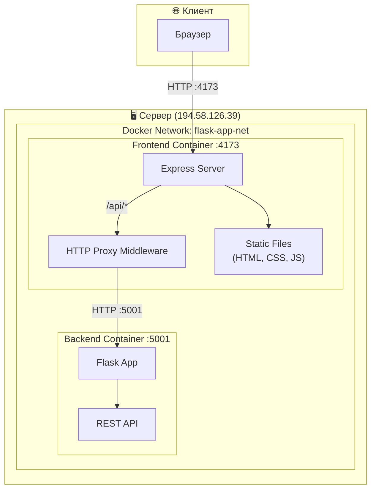
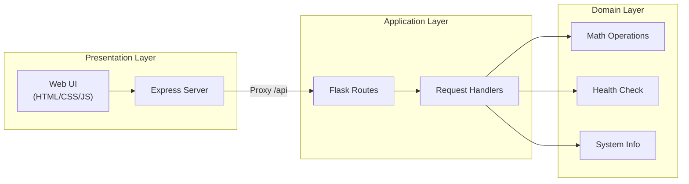
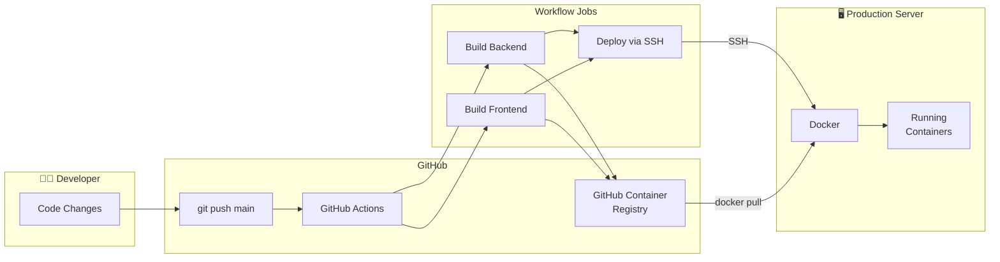
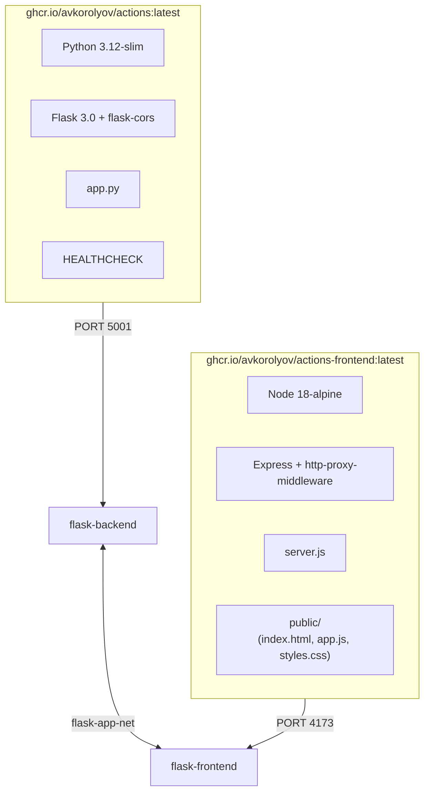
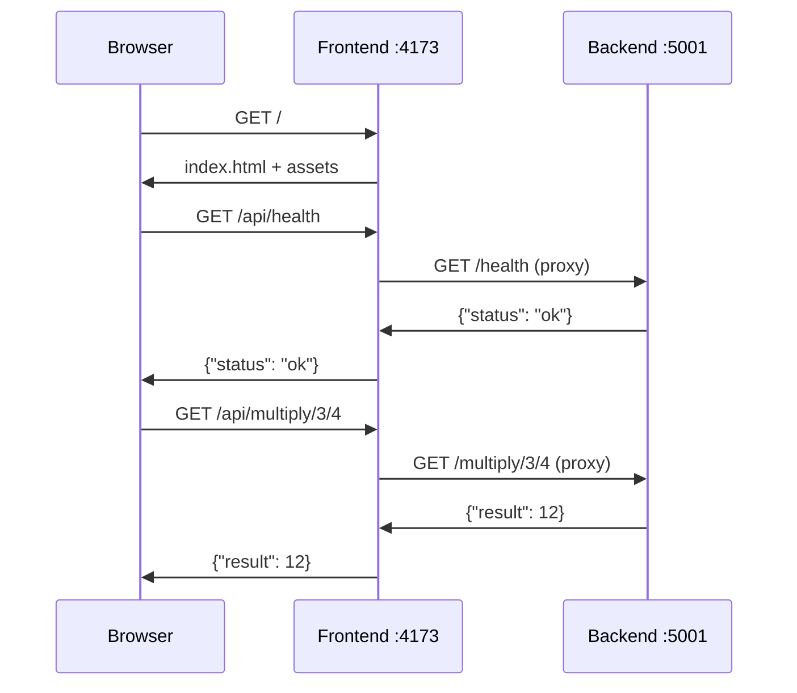

# Архитектура проекта

## Оглавление

- [Обзор](#обзор)
- [Диаграмма архитектуры](#диаграмма-архитектуры)
- [Слои приложения](#слои-приложения)
- [CI/CD Pipeline](#cicd-pipeline)
- [Структура контейнеров](#структура-контейнеров)
- [Сетевое взаимодействие](#сетевое-взаимодействие)
- [Компоненты системы](#компоненты-системы)
- [Порты](#порты)
- [Переменные окружения](#переменные-окружения)

## Обзор

Проект представляет собой микросервисную архитектуру с двумя контейнерами: Flask backend и Node.js frontend, объединёнными через Docker network.

## Диаграмма архитектуры

## Слои приложения

## CI/CD Pipeline

## Структура контейнеров

## Сетевое взаимодействие

## Компоненты системы

### Backend (Flask)

| Компонент | Описание |
|-----------|----------|
| `app.py` | Основной файл приложения |
| Flask 3.0 | Web-фреймворк |
| flask-cors | CORS middleware |
| REST API | 6 эндпоинтов |

### Frontend (Node.js)

| Компонент | Описание |
|-----------|----------|
| `server.js` | Express сервер с proxy |
| `index.html` | Главная страница UI |
| `app.js` | Клиентская логика |
| `styles.css` | Стили интерфейса |

### Инфраструктура

| Компонент | Описание |
|-----------|----------|
| Docker | Контейнеризация |
| Docker Network | Связь между контейнерами |
| GitHub Actions | CI/CD pipeline |
| GHCR | Хранение Docker-образов |
| SSH | Деплой на сервер |

## Порты

| Сервис | Порт | Описание |
|--------|------|----------|
| Backend | 5001 | Flask REST API |
| Frontend | 4173 | Express + Static files |

## Переменные окружения

### Backend

| Переменная | Значение | Описание |
|------------|----------|----------|
| `PORT` | 5001 | Порт Flask |

### Frontend

| Переменная | Значение | Описание |
|------------|----------|----------|
| `PORT` | 4173 | Порт Express |
| `BACKEND_URL` | http://flask-backend:5001 | URL backend в Docker network |

